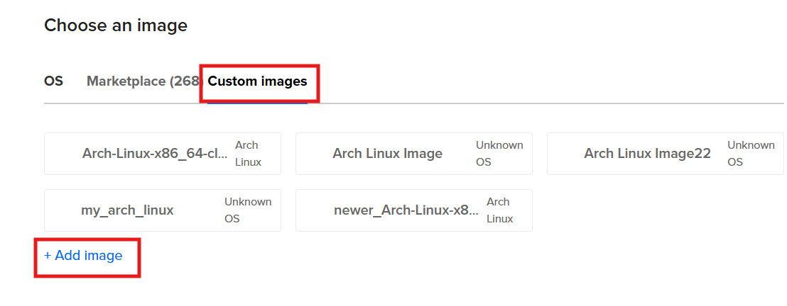
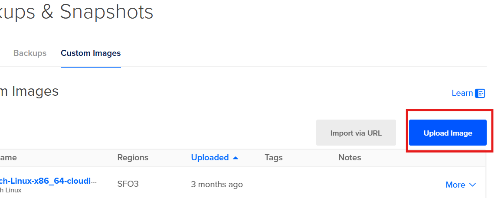
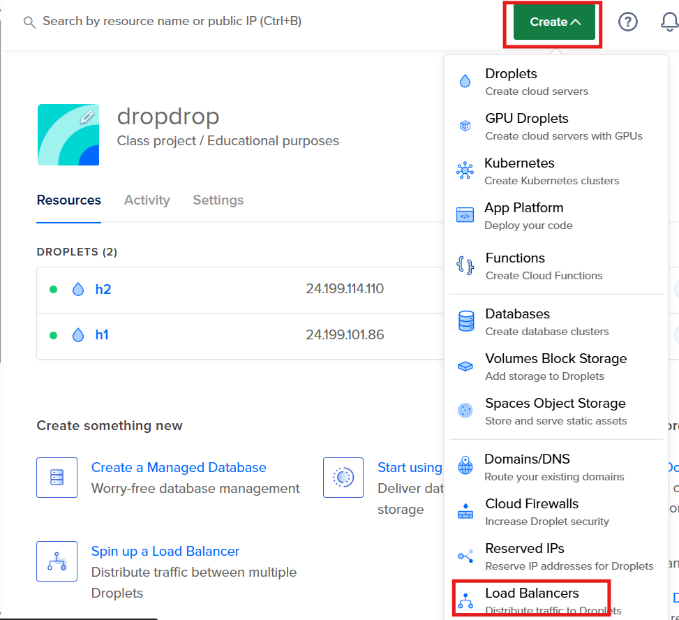
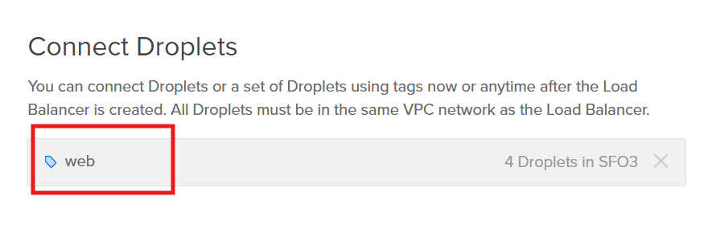

# Linux Assignment 3 Part 2

This assignment will help you to set up two droplet servers with a load balancer. 
Then it will help you to configure each server setting up with the same steps in Linux Assignment 3 Part 1, by running automated scripts.
To know more about what the scripts do, visit [linux-assignment3-part1](https://github.com/nuree-cit/linux-assignment3-part1)

### **Please follow each process in order.**
## 1. Get the newest Arch Linux image
### 1. Go to the Arch Linux download page [Arch Linux - Downloads](https://archlinux.org/download/)
### 2. In the 'VM images' sector, click **git lab instance**
### 3. Click the newest version of **images**
### 4. Scroll down and find the file that contains **'cloudimg'** and **'.qcow2'** in the name.
### 5. Download it.
> [!TIP] 
> **cloudimg** means that this file is optimized for the usage of cloud environment. 
> **.qcow2** is one of the formats that is used for virtual disk. 
## 2. Create a new project
### 1. Go to [DigitalOcean](https://cloud.digitalocean.com/) and log in.

### 2. Click the **New Project** in the left side menu.
### 3. Make a name
### 4. Click the drop down menu and choose **Class project / Educational purposes**
   
> [!NOTE] 
> Actually, it doesn't really matter what purpose you choose.
### 5. Click green button **Create Project**

### 6. Click **Skip for now**

## 3. Create droplets

### 1. Click the **droplet name** you just created on the left side menu.
### 2. Click the green button **Create**
### 3. Click **Droplets**

### 4. Choose Region **San Francisco**
### 5. Choose Datacenter **San Francisco Datacenter 3 SFO3**
> [!TIP] 
> **'SFO3'** is the closest datacenter to the end user, which is us


### 6. Click **Custom images**, and click **Add image**

### 7. Click **Upload Image** and upload the newest Arch Linux image that you have downloaded in the step 1.

### 8. Choose the image you just uploaded

### 9. Choose CPU option you want
### 10.   Choose **SSH Key** for the authentication method and connect keys you want to use.

### 11.  Make **2 Droplets**

### 12.  Give them **Hostname**
### 13.  Give them a tag **web**
> [!IMPORTANT] 
> The tag **'web'** will be used for the load balancer to find which droplets to connect.
### 14. Add to project you just created.
### 15. Click green button **Create Droplet**

## 4. Create a load balancer
### 1. Click the green button **Create**
### 2. Click **Load balancer**

### 3. Choose a type as **Regional**
### 4. Choose a datacenter in **San Francisco 3** 

### 5. Choose default VPC
### 6. Choose Network Visibility **External(Public)**
### 7. Connect droplets by giving a tag **'web'**

### 8. Choose a name for load balancer
### 9. Select the right project
### 10. Click **Create Load Balancer**

## 5. Configure `ssh`
### 1. Open the config file `C:/Users/username/.ssh/config`
### 2. Add this to the `config` file
```
Host h1 #choose host name
    HostName 24.199.114.110 #change it to the actual IP address
    User arch
    PreferredAuthentications publickey
    IdentityFile ~/.ssh/do-key
    StrictHostKeyChecking no
    UserKnownHostsFile /dev/null

Host h2 #choose host name
    HostName 24.199.101.86 #change it to the actual IP address
    User arch
    PreferredAuthentications publickey
    IdentityFile ~/.ssh/do-key
    StrictHostKeyChecking no
    UserKnownHostsFile /dev/null
```
### 3. Choose **host name** for server 1 and server 2
### 4. Get IP addresses from droplets

### 5. Change IP addresses after **HostName**
 > [!IMPORTANT] 
> You may need to change key according to what keys you chose to connect in the step **3-11**.
## 6. Clone necessary files
### 1. In windows, open `powershell`
### 2. Clone the repository
```
git clone https://github.com/nuree-cit/linux-assignment3-part2
```
 > [!IMPORTANT] 
> Remember which folder you have stored cloning repository.
## 7. Move files to the remote server
### 1. Connect `sftp` to one of the server
```
sftp h1
```
 > [!IMPORTANT] 
> You should work in the same folder in the **step 7**.
### 2. Make a remote directory
```
mkdir packages
```
### 3. Upload packages
```
put -r packages
```
### 4. Upload scripts
 ```
put checkCheck
put configScript
put firstFirst
```
 > [!NOTE] 
> This will create a directory `packages` and put scripts in `/home/username/` by default.
## 8. Prepare the scripts execution
### 1. Access to the same server
```
ssh h1
```
### 2. Download `dos2unix`
```bash
sudo pacman -S --noconfirm dos2unix
```
 > [!TIP] 
> The `dos2unix` command makes it sure to fix line-ending format problems if they arise. 
### 3. Transform script to Unix format
```bash
sudo dos2unix firstFirst
```
### 4. Change permission
```bash
sudo chmod u+x firstFirst
```
## 9. Run the scripts
 > [!IMPORTANT] 
> You must run those scripts where they are placed with `sudo` permission.
### 1. Run the script `firstFirst`
```bash
sudo ./firstFirst
```
 > [!NOTE] 
> This might takes time for the updating packages

The script `firstFirst` does:
- install packages
	- neovim
	- nginx
	- tree
- update all the installed packages
- change scripts format to Unix
	- generate_index
	- checkCheck
	- configScript
- change files permission to be executable
	- checkCheck
	- configScript
- change time zone
	- America/Vancouver

### 2. run the script `configScript`
```bash
sudo ./configScript -1
```
- an option must be provided
	-1: for the first server
	-2: for the second server

	To know more about what `configScript` do, visit [linux-assignment3-part1](https://github.com/nuree-cit/linux-assignment3-part1)

### 3. run the script `checkCheck
```bash
sudo ./checkCheck
```
- This script will display some useful information to see if configuration has successfully finished.
	- show fiile tree of `/var/lib/webgen`
	- print contents of test files `file-one` and `file-two`
	- show system status and log of `generate_index.service`, `generate_index.timer` and `nginx.service`

## 10. Repeat for the second server.
### 1. Repeat the tasks from the **step 7** to **step 9** for the second server.
### 2. make sure to use correct server name when use `sftp`, access through `ssh`, and give an option to a script.

---
## Congratulation! you have successfully created and configured new droplet servers with the load balancer!