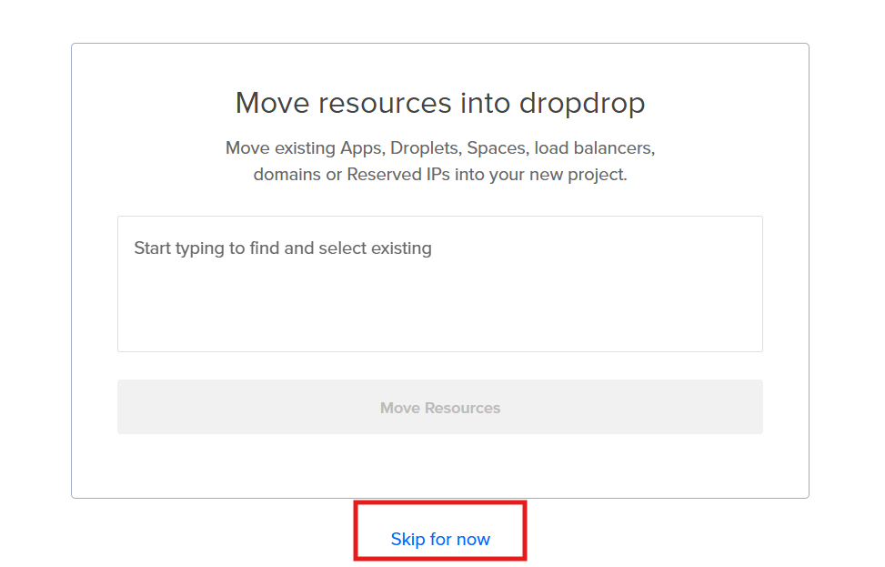
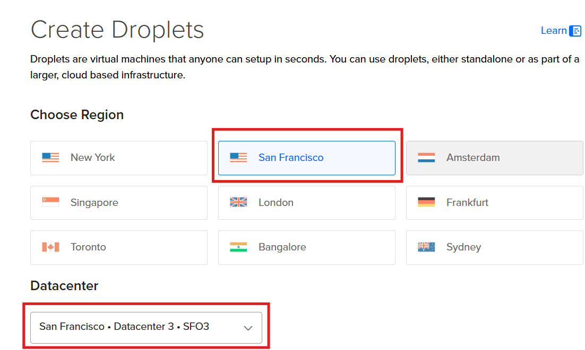
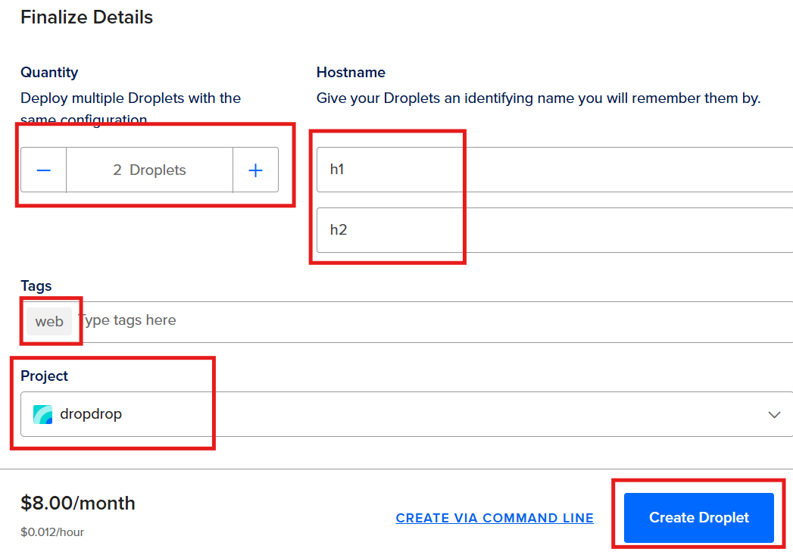
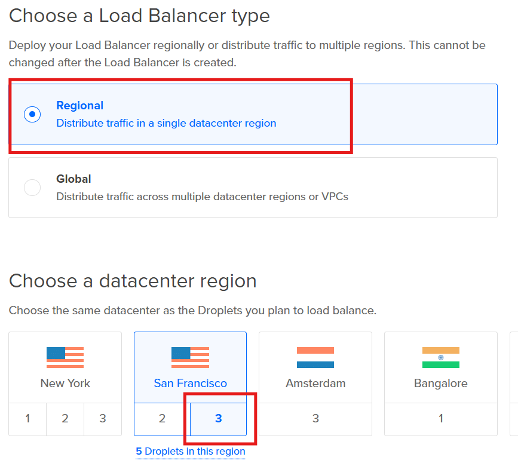
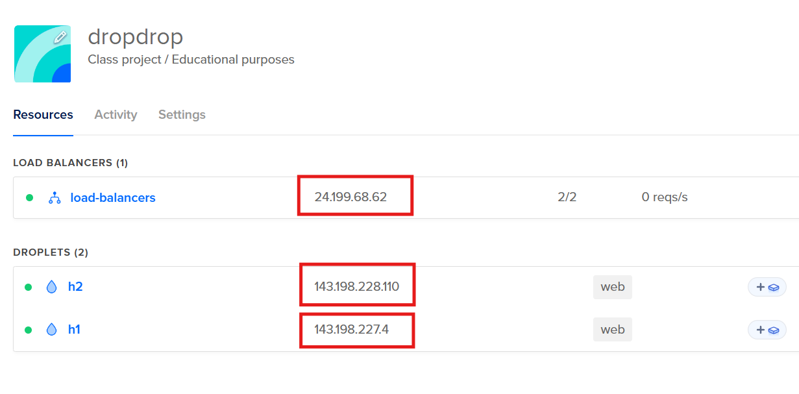
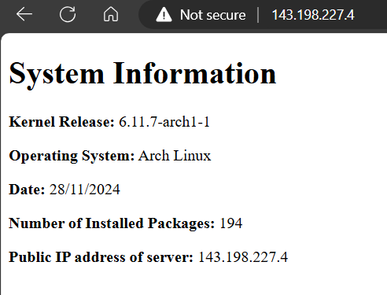
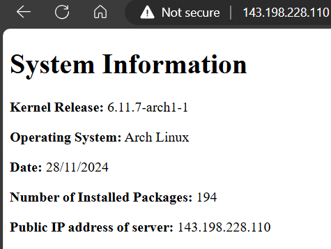
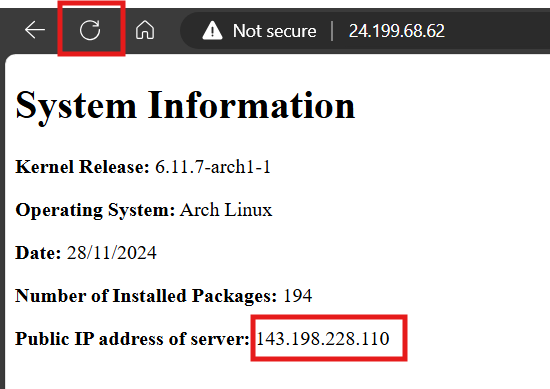
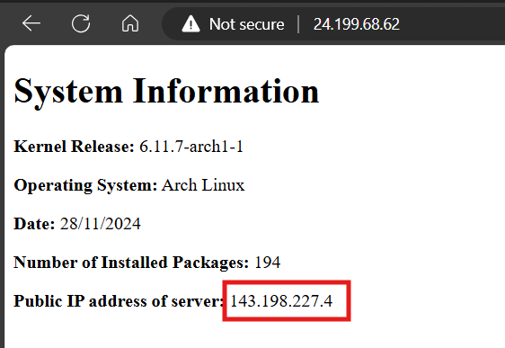

# Linux Assignment 3 Part 2

  
This assignment will help you to set up two droplet servers with a load balancer.

Then it will help you to configure each server setting up with the same steps in Linux Assignment 3 Part 1, by running automated scripts.

To know more about what the scripts do, visit [linux-assignment3-part1](https://github.com/nuree-cit/linux-assignment3-part1). This scripts will do the tasks in the `README.md` for you.

Before you start, you must have:
- Digital Ocean account
- ssh key setting within `config` file

### **Please follow each process in order.**

## 1. Get the newest Arch Linux image

1-1. Go to the Arch Linux download page [Arch Linux - Downloads](https://archlinux.org/download/)

1-2. In the 'VM images' sector, click **git lab instance**

1-3. Click the newest version of **images**

1-4. Scroll down and find the file that contains **'cloudimg'** and **'.qcow2'** in the name.

1-5. Download it into your local device.

> [!TIP]
> **cloudimg** means that this file is optimized for the usage of cloud environment. 
> **.qcow2** is one of the formats that is used for virtual disk.

## 2. Create a new project

2-1. Go to [DigitalOcean](https://cloud.digitalocean.com/) and log in.


2-2. Click the **New Project** in the left side menu.

2-3. Make a name

2-4. Click the drop down menu and choose a purpose
- It doesn't really matter what purpose you choose.

2-5. Click green button **Create Project**


2-6. Click **Skip for now**

#### You will use this project to set up your droplet servers and a load balancer.

## 3. Create droplets


3-1. Click the **project name** you just created in [Step 2](#2-create-a-new-project) on the left side menu.

3-2. Click the green button **Create**

3-3. Click **Droplets**


3-4. Choose Region **San Francisco**

3-5. Choose Datacenter **San Francisco Datacenter 3 SFO3**

> [!TIP]
> We choose **'SFO3'** because that is the closest data center to the end user, which is us.
> 
3-6. Click **Custom images**, and click **Add image**


3-7. Click **Upload Image** and upload the newest Arch Linux image that you have downloaded in the [Step 1](#1-get-the-newest-arch-linux-image).


3-8. Choose the image you just uploaded


3-9. Choose CPU option you want
> [!TIP]
> The cheapest option is the left most one under the basic plan.

3-10. Choose **SSH Key** for the authentication method and connect keys you want to use.

> [!TIP]
> Keep in mind which key you choose for the following [Step 5-2](#5-2-add-this-code-to-the-config-file)

3-11.  Make **2 Droplets**


3-12.  Give them **Hostname**

3-13.  Give them a tag **'web'**

> [!IMPORTANT]
> The tag **'web'** will be used for the load balancer to find which droplets to connect.

3-14. Add to project you just created.

3-15. Click the blue button **Create Droplet**

#### Now you have created your droplet servers.

## 4. Create a load balancer
A load balancer stays between servers and the internet, distributing network traffic across multiple servers to ensure no single server becomes overwhelmed.

4-1. Click the green button **Create**


4-2. Click **Load balancer**

4-3. Choose a type as **Regional**


4-4. Choose a datacenter in **San Francisco 3**

4-5. Choose default VPC

4-6. Choose Network Visibility **External(Public)**

4-7. Connect droplets by giving a tag **'web'**


4-8. Choose a name for load balancer


4-9. Select the project

4-10. Click **Create Load Balancer**

  #### Now you finished setting up the load balancer.

## 5. Configure `ssh`

5-1. Open the config file `C:/Users/username/.ssh/config`

> [!NOTE]
> The file path for `config` may differ depends on where you set.

5-2. Add this code to the config file

```
Host servername1 #choose the host name you want to use for the first server
    HostName 24.199.114.110 #change it to the actual IP address of your first server from step 5-4.
    User arch #
    PreferredAuthentications publickey
    IdentityFile ~/.ssh/do-key #change it to your key from the step 3-10.
    StrictHostKeyChecking no
    UserKnownHostsFile /dev/null

Host servername2 #choose the host name you want to use for the second server
    HostName 24.199.114.110 #change it to the actual IP address of your second server from step 5-4.
    User arch
    PreferredAuthentications publickey
    IdentityFile ~/.ssh/do-key
    StrictHostKeyChecking no
    UserKnownHostsFile /dev/null
```

5-3. Choose **host name** for server 1 and server 2

5-4. Change ssh key file path.

5-5. Get IP addresses from droplets and change.

> [!IMPORTANT]
> You need the `ipv4` ip address, not a `private IP`

5-5. Save file and exit.

#### Now you are ready to connect your servers through `ssh`.

## 6. Connect to the server and clone necessary files

> [!IMPORTANT]
> From here, you will first work with your server 1 only.
> For the server 2, you will be noticed when you need it.

6-1. In windows, open `powershell`

6-2. Connect to the server through `ssh`

```shell
ssh servername
```
- Change `servername` to your actual server name from [Step 5-2](#2-add-this-code-to-the-config-file) `config` file.

6.3. Update packages
```shell
sudo pacman -Syu --noconfirm
```

6-4. Download package `git`

```shell
sudo pacman -S --noconfirm git
```

6-5. Clone repository

```shell
git clone https://github.com/nuree-cit/linux-assignment3-part2
```
- This is the step you download the necessary code to your server.

6-6. Update file permission

```shell
sudo chmod -R u+x ./linux-assignment3-part2
```

#### Now you are ready to run automated configure scripts.

## 7. Run the scripts

> [!IMPORTANT]
> You must run those scripts with `sudo` permission.

7-1. Run the script `configScript`

```bash
sudo ./linux-assignment3-part2/configScript -1
```

An option must be provided

-1: for the server 1

-2: for the server 2

if you see:

`script finished!`

Your script finished its work successfully.

7-2. run the script `checkCheck`

```bash
sudo ./linux-assignment3-part2/checkCheck
```

- This script will display some useful information to see if configuration has successfully finished.

    - show file tree of `/var/lib/webgen`

    - print contents of test files `file-one` and `file-two`

    - show system status and log of `generate_index.service`, `generate_index.timer` and `nginx.service`


## 8. Configuring for the second server.

8-1. Repeat the tasks from the [Step 6](#6-connect-to-the-server-and-clone-necessary-files) for the server 2.

> [!IMPORTANT]
> Make sure you connect to the server 2 and run the `configScript` script with option `-2`  

## 9. Check your configuration through accessing IP addresses.
9-1. Go to the project in [DigitalOcean](https://cloud.digitalocean.com/)


9-2. Check the IP addresses of **load balancer**, **server 1** and **server 2**

9-3. Copy and paste each of the IP address to the web browser.

**For the server 1**
http://143.198.227.4/



**For the server 2**
http://143.198.228.110/



**For the load balancer**
http://24.199.68.62/





If you click a refresh button few times, you will see the public IP address of server is changed from server 1 to 2, and 2 to 1.

This is the evidence that the load balancer is managing incoming traffic between your server 1 and 2.

## Congratulation! you have successfully created and configured new droplet servers with the load balancer!